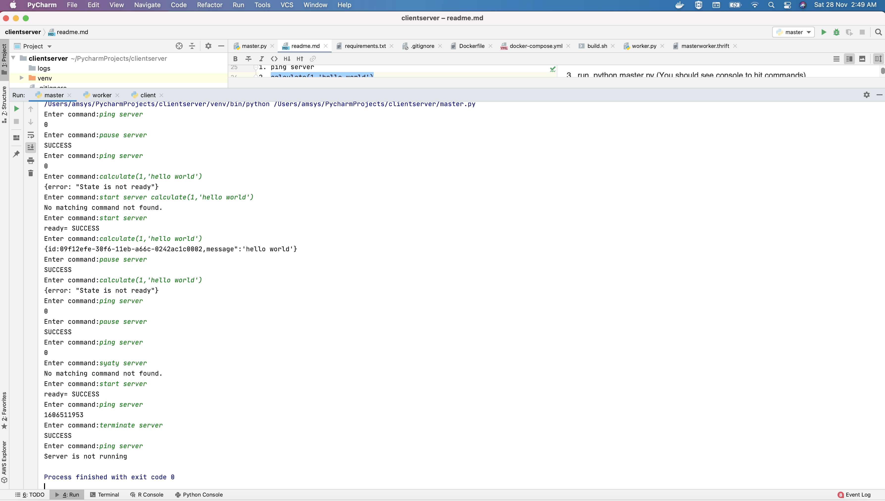

# Client server communication using Thrift

###Few notes
The thrift library is written in python not Apache Thrift)

Naming convention, client is the worker and server is the master.

Lets get cracking with running this..

1. To start client, get up with docker container, run this,  sh build.sh

2. To start master, we go inside docker, run this, docker exec -it clientserver_client-server-thrift3_1 /bin/sh

3. run, python master.py (You should see console to hit commands)

Following is the syntax of the commands

Control command-

1. start server - gets server to ready state
2. pause server - gets server to unready state
3. terminate server - terminates server

Data command-
1. ping server
2. calculate(1,'hello world')

If you want to connect to client via your host machine, run following,

1. pip install -r requirements.txt
2. python master.py

You can have a look at command execution,

